# Water Potability Classification Project 💧


[🇬🇧 English](#english) | [🇹🇷 Türkçe](#türkçe)

---

<a name="english"></a>
## 🇬🇧 English

### 1. Project Overview
This project aims to predict the potability of water based on various water quality metrics (pH, Hardness, Solids, Chloramines, etc.). The goal is to classify water samples as **Potable (1)** or **Not Potable (0)** using machine learning techniques.

This repository consolidates two different analytical approaches to tackle the classification problem on a challenging dataset.

### 2. Dataset & Literature Review
**Dataset Context:** The dataset consists of 3276 water samples.
**Challenge:** This dataset is known in the machine learning community as "noisy" and "hard to classify" due to the low correlation between features and the target variable.
**Literature Alignment:** Similar studies in the literature typically achieve accuracy scores between **60% and 68%** without data leakage. The results obtained in this project (%62-%64) are consistent with real-world scenarios and literature benchmarks.

### 3. Key Preprocessing Techniques
Since the raw data was imbalanced and contained missing values, the following techniques were applied:

* **KNN Imputer:** Instead of filling missing values with the mean/median, the **K-Nearest Neighbors** algorithm was used to estimate values based on sample similarity, preserving data distribution.
* **SMOTE (Synthetic Minority Over-sampling Technique):** The dataset was imbalanced (fewer "Potable" samples). SMOTE was used to generate synthetic samples for the minority class to prevent model bias.
* **Scaling:** Features were normalized using StandardScaler to ensure distance-based algorithms work correctly.

---

### 📊 [Part 1: XGBoost & Random Forest Approach](xgb-rf/waterPotabilityClassification_xgb-rf.ipynb)
*(Click the title above to view the code)*

In this section, tree-based ensemble methods were utilized.

#### A. Exploratory Data Analysis (EDA)
Before modeling, the data was visualized to understand relationships.

1.  **Correlation Heatmap:**
    This heatmap shows the relationship between features. The low correlation values indicate that no single feature is enough to determine potability, necessitating complex non-linear models.
    > 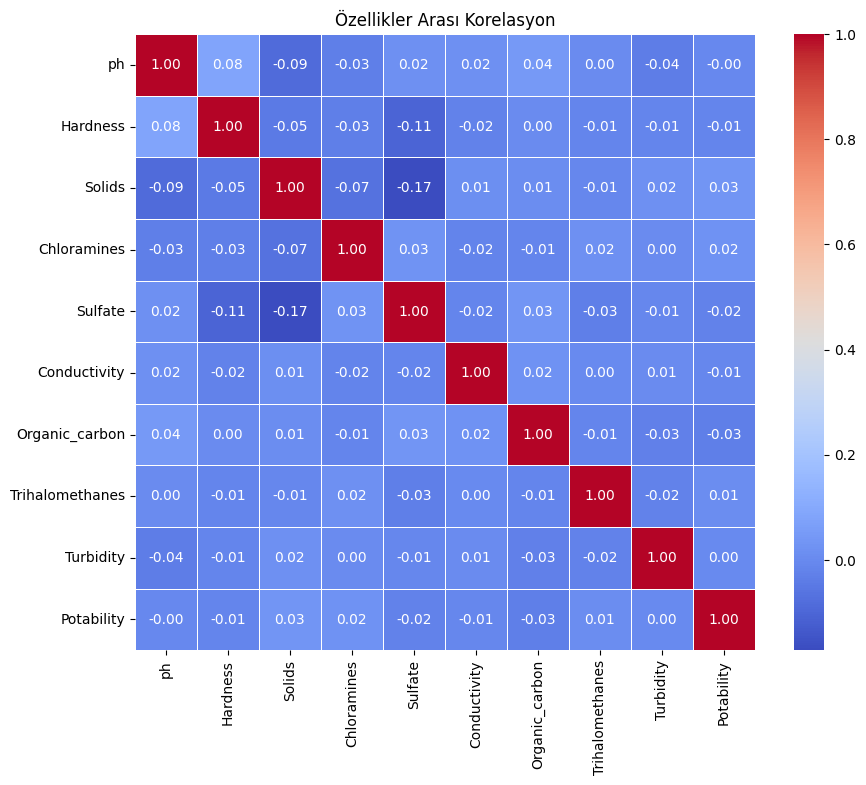

2.  **Class Distribution:**
    Visualizing the target variable balance before and after SMOTE.
    > 

3.  **Feature Distribution:**
    Boxplots and histograms showing how features like pH and Hardness vary between Potable and Not Potable classes.
    > 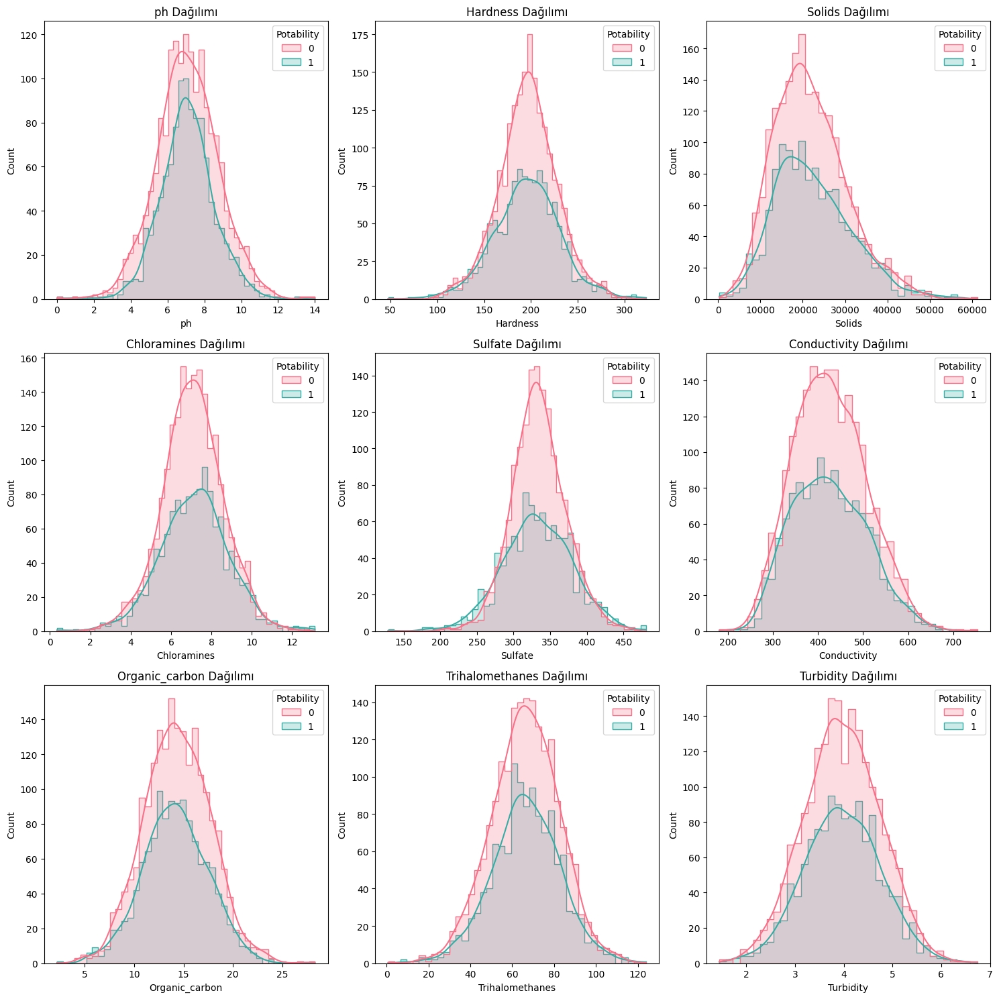

#### B. Model Performance (Part 1)

**1. Random Forest Classifier**
Random Forest provided the most stable results among tree-based models.

* **Accuracy:** **63.72%**
* **Confusion Matrix:**
    > 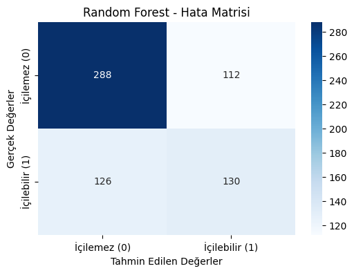

```text
              precision    recall  f1-score   support

           0       0.70      0.72      0.71       400
           1       0.54      0.51      0.52       256

    accuracy                           0.64       656
   macro avg       0.62      0.61      0.61       656
weighted avg       0.63      0.64      0.64       656
```

**2. XGBoost Classifier**
XGBoost was tuned for gradient boosting performance.

* **Accuracy:** **62.50%**
* **Confusion Matrix:**
    > 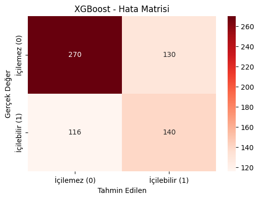

```text
               precision    recall  f1-score   support

           0       0.70      0.68      0.69       400
           1       0.52      0.55      0.53       256

    accuracy                           0.62       656
   macro avg       0.61      0.61      0.61       656
weighted avg       0.63      0.62      0.63       656
```
#### C. Evaluation (Part 1)

* **ROC-AUC Curve:** Comparison of the models' ability to distinguish classes.
  > 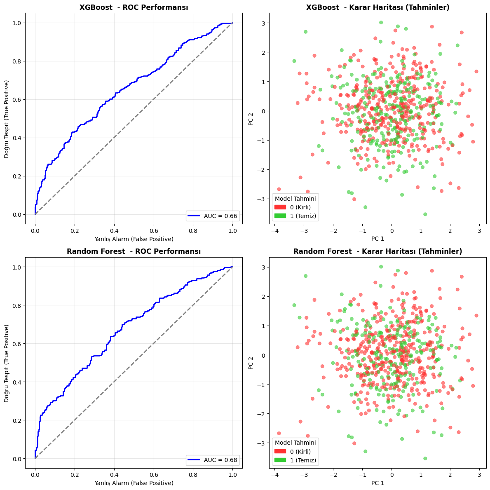
---

### 🚀 [Part 2: CatBoost, SVM & MLP Approach](catb-svm-mlp/waterPotabilityClassification_catb-svm-mlp.ipynb)
*(Click the title above to view the code)*

In this second part of the project, we explored different algorithms (**CatBoost, SVM, and MLP**) and applied a different preprocessing strategy compared to Part 1 to observe the impact on model performance.

#### A. Preprocessing & Feature Engineering (Specific to Part 2)
Unlike Part 1, the following techniques were applied here:
* **Mean Imputation:** Missing values were filled using the mean strategy instead of KNN.
* **Feature Engineering:** New synthetic features were created to capture hidden relationships between water quality metrics.
* **Scaling:** Data was scaled (StandardScaler/MinMaxScaler) which is crucial for distance-based models like SVM and Neural Networks (MLP).

#### B. Exploratory Data Analysis (Part 2)
Since the feature set changed due to engineering and imputation methods, the correlations were re-evaluated.

1.  **Correlation Heatmap (Post-Engineering):**
    Visualizing the relationships after adding new features and mean imputation.
    > 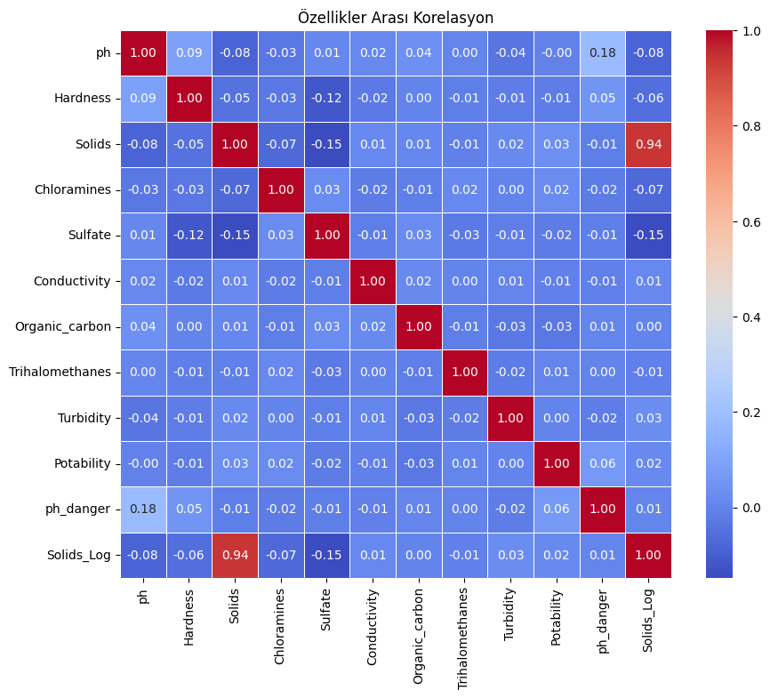

2.  **Feature Distribution:**
    > 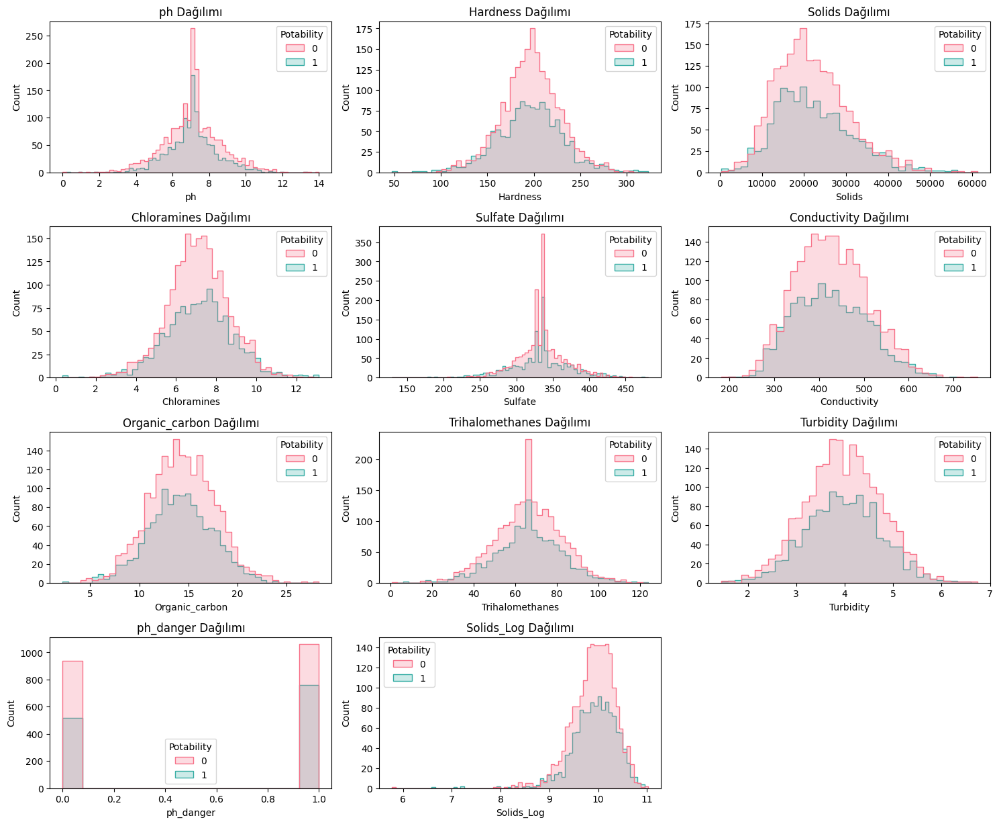

#### C. Model Performance (Part 2)

**1. MLP Classifier (Multi-Layer Perceptron)**
The Artificial Neural Network (MLP) achieved the **highest accuracy** across all models in this project.

* **Accuracy:** **66.01%**
* **Confusion Matrix:**
    > 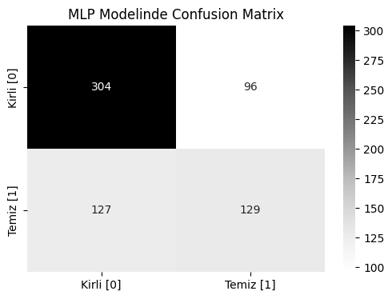

```text
              precision    recall  f1-score   support

           0       0.71      0.76      0.73       400
           1       0.57      0.50      0.54       256

    accuracy                           0.66       656
   macro avg       0.64      0.63      0.63       656
weighted avg       0.65      0.66      0.66       656
```
**2. CatBoost Classifier**
A robust gradient boosting algorithm that handles categorical data well.
* **Accuracy:** **62.80%**
* **Confusion Matrix:**
  > 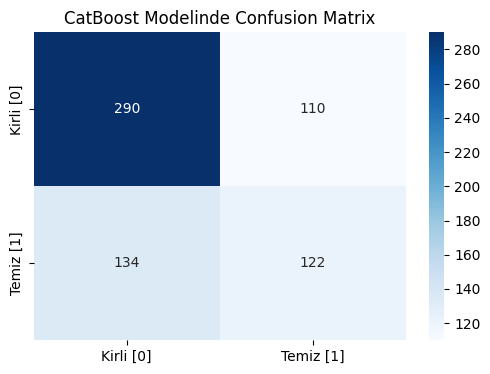

```text
              precision    recall  f1-score   support

           0       0.68      0.72      0.70       400
           1       0.53      0.48      0.50       256

    accuracy                           0.63       656
   macro avg       0.60      0.60      0.60       656
weighted avg       0.62      0.63      0.62       656
```
**3. SVM (Support Vector Machine)**
SVM struggled slightly compared to ensemble and neural network methods on this specific dataset.
* **Accuracy:** **61.12%**
* **Confusion Matrix:**
  > 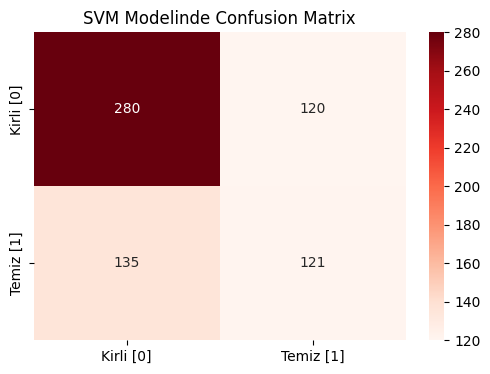

```text
              precision    recall  f1-score   support

           0       0.67      0.70      0.69       400
           1       0.50      0.47      0.49       256

    accuracy                           0.61       656
   macro avg       0.59      0.59      0.59       656
weighted avg       0.61      0.61      0.61       656
```

#### D. Final Evaluation & Visuals (Part 2)
* **ROC-AUC Performance:** Evaluating the True Positive vs False Positive rates for the new models.
  > 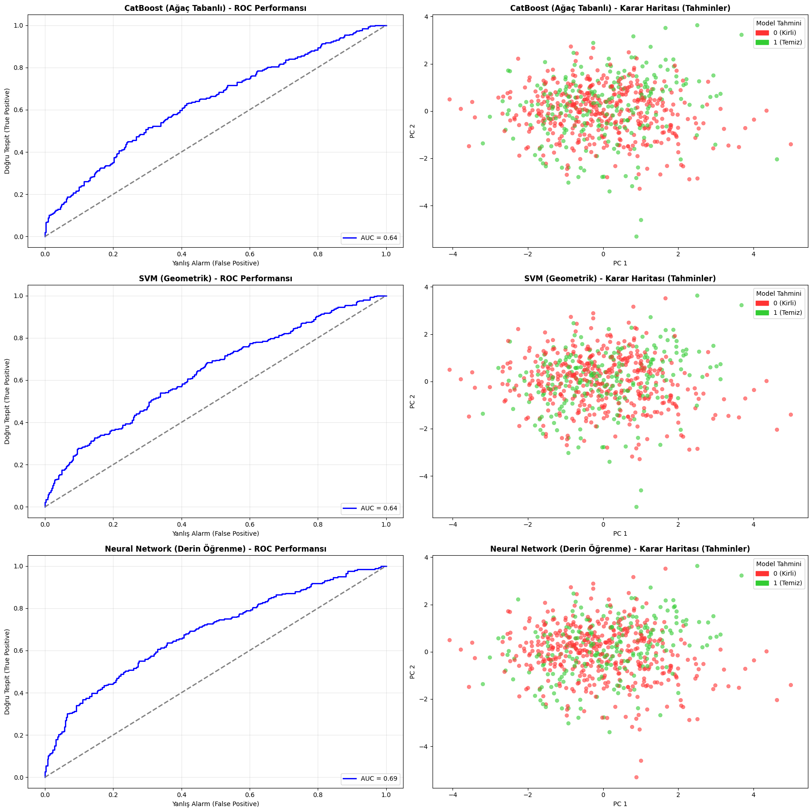

### 🏆 Model Performances & Results

Comparing all 5 models developed across both notebooks, the MLP (Neural Network) provided the best ability to classify water potability, followed closely by Random Forest.

| Rank | Model | Accuracy | Approach |
| :--- | :---: | :---: | :---: |
| 🥇 | **MLP (Neural Network)** | 66.01% | Part 2 |
| 🥈 | **Random Forest** | 63.72% | Part 1 | 
| 🥉 | **CatBoost** | 62.80% | Part 2 |
| 4 | **XGBoost** | 62.50% | Part 1 |
| 5 | **SVM** | 61.13% | Part 2 |

**Conclusion:**
While the dataset is challenging with low feature correlation, the MLP model with Feature Engineering and Mean Imputation yielded the most promising results for this classification task. 

---

<a name="türkçe"></a>
## 🇹🇷 Türkçe

### 1. Proje Genel Bakışı
Bu proje, çeşitli su kalitesi metriklerine (pH, Sertlik, Katı Maddeler, Kloraminler vb.) dayanarak suyun içilebilirliğini tahmin etmeyi amaçlamaktadır. Hedef, makine öğrenimi tekniklerini kullanarak su örneklerini **İçilebilir (1)** veya **İçilemez (0)** olarak sınıflandırmaktır.

Bu depo, zorlu bir veri setindeki sınıflandırma problemini ele almak için iki farklı analitik yaklaşımı birleştirmektedir.

### 2. Veri Seti ve Literatür Taraması
**Veri Seti Bağlamı:** Veri seti 3276 su örneğinden oluşmaktadır.
**Zorluk:** Bu veri seti, özellikler ve hedef değişken arasındaki düşük korelasyon nedeniyle makine öğrenimi topluluğunda "gürültülü" ve "sınıflandırılması zor" olarak bilinir.
**Literatür Uyumu:** Literatürdeki benzer çalışmalar, veri sızıntısı olmadan genellikle **%60 ile %68** arasında doğruluk skorları elde etmektedir. Bu projede elde edilen sonuçlar (%62-%64), gerçek dünya senaryoları ve literatür kıyaslamalarıyla tutarlıdır.

### 3. Temel Ön İşleme Teknikleri
Ham veri dengesiz olduğundan ve eksik değerler içerdiğinden, aşağıdaki teknikler uygulanmıştır:

* **KNN Imputer:** Eksik değerleri ortalama/medyan ile doldurmak yerine, veri dağılımını koruyarak örnek benzerliğine dayalı değerleri tahmin etmek için **K-En Yakın Komşu (K-Nearest Neighbors)** algoritması kullanıldı.
* **SMOTE (Sentetik Azınlık Aşırı Örnekleme Tekniği):** Veri seti dengesizdi (daha az "İçilebilir" örnek mevcuttu). Model yanlılığını önlemek amacıyla azınlık sınıfı için sentetik örnekler oluşturmak üzere SMOTE kullanıldı.
* **Ölçeklendirme (Scaling):** Mesafe tabanlı algoritmaların doğru çalışmasını sağlamak için özellikler StandardScaler kullanılarak normalleştirildi.

---

### 📊 [Bölüm 1: XGBoost & Random Forest Yaklaşımı](xgb-rf/waterPotabilityClassification_xgb-rf.ipynb)
*(Koda gitmek için yukarıdaki başlığa tıklayın)*

Bu bölümde, ağaç tabanlı topluluk (ensemble) yöntemleri kullanılmıştır.

#### A. Keşifsel Veri Analizi (EDA)
Modelleme öncesinde, ilişkileri anlamak için veri görselleştirildi.

1.  **Korelasyon Isı Haritası:**
    Bu ısı haritası özellikler arasındaki ilişkiyi gösterir. Düşük korelasyon değerleri, içilebilirliği belirlemek için tek bir özelliğin yeterli olmadığını, bu nedenle karmaşık doğrusal olmayan modellere ihtiyaç duyulduğunu gösterir.
    > 

2.  **Sınıf Dağılımı:**
    SMOTE öncesi ve sonrası hedef değişken dengesinin görselleştirilmesi.
    > 

3.  **Özellik Dağılımı:**
    pH ve Sertlik gibi özelliklerin İçilebilir ve İçilemez sınıfları arasında nasıl değiştiğini gösteren kutu grafikleri (boxplots) ve histogramlar.
    > 

#### B. Model Performansı (Bölüm 1)

**1. Random Forest Sınıflandırıcı**
Random Forest, ağaç tabanlı modeller arasında en kararlı sonuçları sağladı.

* **Doğruluk (Accuracy):** **%63.72**
* **Karmaşıklık Matrisi (Confusion Matrix):**
    > 

```text
              precision    recall  f1-score   support

           0       0.70      0.72      0.71       400
           1       0.54      0.51      0.52       256

    accuracy                           0.64       656
   macro avg       0.62      0.61      0.61       656
weighted avg       0.63      0.64      0.64       656
```

**2. XGBoost Sınıflandırıcı**
XGBoost, gradient boosting performansı için ayarlandı.

* **Doğruluk (Accuracy):** **%62.50**
* **Karmaşıklık Matrisi (Confusion Matrix):**
    > 

```text
              precision    recall  f1-score   support

           0       0.70      0.68      0.69       400
           1       0.52      0.55      0.53       256

    accuracy                           0.62       656
   macro avg       0.61      0.61      0.61       656
weighted avg       0.63      0.62      0.63       656
```
#### C. Değerlendirme (Part 1)

* **ROC-AUC Eğrisi:** Modellerin sınıfları ayırt etme yeteneğinin karşılaştırılması.
  > 
---

### 🚀 [Bölüm 2: CatBoost, SVM & MLP Yaklaşımı](catb-svm-mlp/waterPotabilityClassification_catb-svm-mlp.ipynb)
*(Koda gitmek için yukarıdaki başlığa tıklayın)*

Projenin bu ikinci bölümünde, farklı algoritmalar (**CatBoost, SVM ve MLP**) denenmiş ve Bölüm 1'den farklı bir ön işleme stratejisi uygulanarak model performansına etkisi gözlemlenmiştir.

#### A. Ön İşleme ve Özellik Mühendisliği (Bölüm 2'ye Özel)
Bölüm 1'in aksine, bu çalışmada şu teknikler uygulanmıştır:
* **Ortalama ile Doldurma (Mean Imputation):** Eksik veriler KNN yerine ortalama değerler kullanılarak doldurulmuştur.
* **Özellik Mühendisliği (Feature Engineering):** Su kalite metrikleri arasındaki gizli ilişkileri yakalamak için yeni (sentetik) sütunlar oluşturulmuştur.
* **Ölçeklendirme:** SVM ve Sinir Ağları (MLP) gibi uzaklık tabanlı modellerin başarısı için veriler ölçeklendirilmiştir (Scaling).

#### B. Keşifsel Veri Analizi (Bölüm 2)
Özellik mühendisliği ve farklı doldurma yöntemleri nedeniyle veri seti değiştiği için korelasyonlar yeniden değerlendirilmiştir.

1.  **Korelasyon Isı Haritası (Heatmap):**
    Yeni özelliklerin eklenmesi ve ortalama ile doldurma işlemi sonrası ilişkilerin görselleştirilmesi.
    > 

2.  **Özellik Dağılım Grafiği:**
    > 
    
#### C. Model Performansı (Bölüm 2)

**1. MLP Classifier (Yapay Sinir Ağı)**
MLP, tüm proje genelinde denenen modeller arasında **en yüksek doğruluğu** sağlayan model olmuştur.

* **Doğruluk (Accuracy):** **%66.01**
* **Karmaşıklık Matrisi (Confusion Matrix):**
    > 

```text
              precision    recall  f1-score   support

           0       0.71      0.76      0.73       400
           1       0.57      0.50      0.54       256

    accuracy                           0.66       656
   macro avg       0.64      0.63      0.63       656
weighted avg       0.65      0.66      0.66       656
```
**2. CatBoost Classifier**
Kategorik verilerle güçlü çalışan popüler bir gradient boosting algoritmasıdır.
* **Doğruluk:** **62.80%**
* **Confusion Matrix:**
  > 

```text
              precision    recall  f1-score   support

           0       0.68      0.72      0.70       400
           1       0.53      0.48      0.50       256

    accuracy                           0.63       656
   macro avg       0.60      0.60      0.60       656
weighted avg       0.62      0.63      0.62       656
```
**3. SVM (Support Vector Machine)**
SVM, bu veri setinde topluluk (ensemble) ve sinir ağı yöntemlerine kıyasla daha düşük bir performans göstermiştir.
* **Doğruluk:** **61.12%**
* **Confusion Matrix:**
  > 

```text
              precision    recall  f1-score   support

           0       0.67      0.70      0.69       400
           1       0.50      0.47      0.49       256

    accuracy                           0.61       656
   macro avg       0.59      0.59      0.59       656
weighted avg       0.61      0.61      0.61       656
```
#### D. Final Evaluation & Visuals (Part 2)
* **ROC-AUC Performance:** Modellerin doğru pozitif ve yanlış pozitif oranlarının karşılaştırmalı eğrisi.
  > 

### 🏆 Proje Sonucu: Tüm Modellerin Karşılaştırılması

İki farklı dosyada geliştirilen 5 model karşılaştırıldığında, MLP (Yapay Sinir Ağı) suyun içilebilirliğini tahmin etmede en başarılı model olmuştur.

| Sıralama | Model | Doğruluk | Kısım |
| :--- | :---: | :---: | :---: |
| 🥇 | **MLP (Neural Network)** | 66.01% | Bölüm 2 |
| 🥈 | **Random Forest** | 63.72% | Bölüm 1 | 
| 🥉 | **CatBoost** | 62.80% | Bölüm 2 |
| 4 | **XGBoost** | 62.50% | Bölüm 1 |
| 5 | **SVM** | 61.13% | Bölüm 2 |

**Sonuç:**
Veri seti düşük korelasyonlu zor bir yapıya sahip olsa da, Özellik Mühendisliği ve Ortalama ile Doldurma tekniklerini kullanan MLP modeli, bu sınıflandırma problemi için en umut verici sonuçları üretmiştir.
